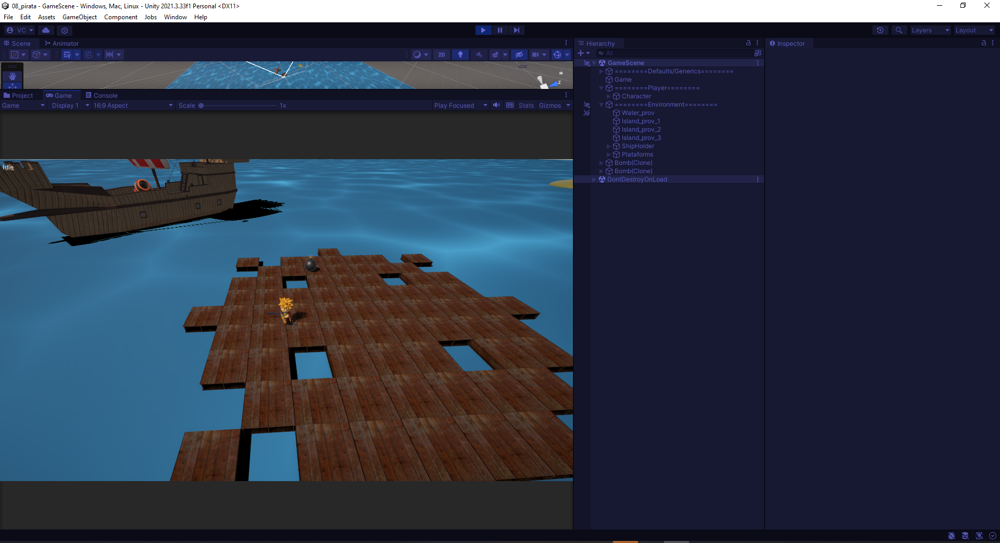

# pirate_game_basics

Unidade de introdução a técnicas artísticas da DIO incluindo: UI, sonoplastia, animação de personagens

*Projeto não publicado ainda*

### O que já foi feito
* Utilização dos assets da asset store para:
  * Character: [RPG Tiny Hero](https://assetstore.unity.com/packages/3d/characters/humanoids/rpg-tiny-hero-duo-pbr-polyart-225148)
  * Ship: [Sailing Ships](https://assetstore.unity.com/packages/3d/vehicles/sea/sailing-ships-14th-15th-century-198426)
  * Partículas: [Particle Pack](https://opengameart.org/content/particle-pack-80-sprites)
  * Canhoes: [Stylish Cannon Pack](https://assetstore.unity.com/packages/3d/props/weapons/stylish-cannon-pack-174145)
  * Madeira para o piso: [Wooden Pallet Pack](https://assetstore.unity.com/packages/3d/props/industrial/wooden-pallet-pack-657)
* Bomba, incluindo:
  * Animação do pavio.
  * Animação de explosão.
  * Destruição de plataformas.
* Movimentação de personagem incluindo:
  * Máquina de estados via código com o estados: Idle e Walking.
  * Implementação de animações correspondentes.
* Rotação do navio.
* Canhão e disparo das bombas.

### O que será feito
* Sonoplastia
* Dano e game over
* UI
* Superar problema do deslizar pela superfície
* Menu Inicial
* Executável para Windows
* Interface para controle

### Backlog futuro
* N/D